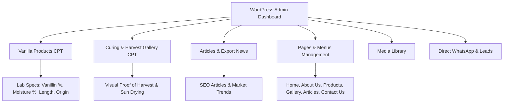

# 📋 Grand Vanilla ID — CMS Requirements Specification

> **Project**: Grand Vanilla Indonesia (B2B Vanilla Supplier & Exporter)  
> **Client**: Faris Muafa  
> **Vendor**: Jasa Digital Nirwana (Fadel Rahmadhan)  
> **Architecture**: WordPress 6.x + Custom Theme (`grand-vanilla-theme`)  
> **Language**: English Only  

---

## 1. Executive Summary & Business Objectives

Grand Vanilla Indonesia connects global business buyers (flavor houses, extract manufacturers, boutique bakeries, spice importers) directly with Indonesian agroforestry vanilla farms. The website acts as the primary international digital storefront to establish brand credibility, showcase laboratory-tested quality specifications, and capture qualified wholesale quotation leads (FOB / CIF).

---

## 2. Core CMS Capabilities & Data Architecture

---

## 3. Detailed CMS Modules

### 🌿 Module 1: Vanilla Products Catalog (`vanilla_product`)
- **Purpose**: Showcase vanilla pod varieties, cuts, extract grade beans, and OEM packaging.
- **Fields**:
  - `Post Title`: Botanical & commercial product name (e.g. *Indonesian Planifolia Gourmet Vanilla Beans Grade A*).
  - `Content / Editor`: Comprehensive description, flavor notes, culinary & industrial applications.
  - `Featured Image`: High-resolution product thumbnail (displaying supple dark pods).
  - **Custom Lab Specifications Meta Box**:
    - `_gv_grade`: Classification / Grade (*Gourmet Grade A*, *Floral Grade*, *Extraction Grade B*).
    - `_gv_vanillin`: Certified vanillin concentration percentage (*1.8% – 2.4%*).
    - `_gv_moisture`: Moisture content percentage (*28% – 35%*).
    - `_gv_length`: Average pod length (*16 – 20 cm*).
    - `_gv_origin`: Harvesting terroir & region (*Bali, East Java, Papua*).
- **Taxonomy**: `product_variety` (Planifolia, Tahitensis, Powder, Extract, Bulk/OEM).

---

### 📷 Module 2: Harvest & Curing Gallery (`vanilla_gallery`)
- **Purpose**: Visual documentation and trust proof for overseas buyers showing organic agroforestry farming, hand pollination, sun drying, and night sweating in wooden crates.
- **Fields**:
  - `Post Title`: Step or activity name (*Harvest at Peak Yellow Tips*, *Traditional Sun Curing Decks*).
  - `Featured Image`: High quality plantation / warehouse photo.
  - `Excerpt / Description`: Concise explanation of the quality assurance step.

---

### ✍️ Module 3: Articles & SEO Insights (`post`)
- **Purpose**: Drive organic international Google search traffic regarding Indonesian vanilla supply, FOB freight rates, and harvest seasons.
- **Fields**:
  - Standard WordPress Posts with categories (*Harvest Reports*, *Market Trends*, *Export Guides*), featured images, tags, and SEO meta.

---

### 📄 Module 4: 6 Core PRD Pages
1. **Home (`front-page.php`)**: Company hero, 4 key export highlights, featured products grid with live lab pills, sun-curing story, and quotation CTA.
2. **About Us (`page-about.php`)**: Mission statement, direct farm-gate model, sustainable agroforestry practices, and global logistics hubs.
3. **Products (`archive-vanilla_product.php`)**: Full catalog grid with filtering, variety badges, and inquiry buttons.
4. **Gallery (`page-gallery.php`)**: Grid of harvest, curing, sorting, and packaging documentation.
5. **Articles (`index.php`)**: Blog archive with latest market insights.
6. **Contact Us (`page-contact.php`)**: Direct quotation request form, official export email (`export@grandvanilla.id`), and direct WhatsApp link (`+62 812-2697-4731`).

---

### 📱 Module 5: B2B Leads & WhatsApp Routing
- **Primary WhatsApp Admin**: `+62 812-2697-4731` (Faris Muafa / Grand Vanilla Export Desk).
- **Automated Message Template**: Prefills buyer interest with the specific product name clicked, target volume, and destination port.

---

## 4. Admin User Roles & Access
- **Administrator (Faris Muafa)**: Full access to publish products, update lab specifications, upload media, publish articles, and manage site menus.
- **Editor / Staff**: Can draft and publish articles and gallery items.
