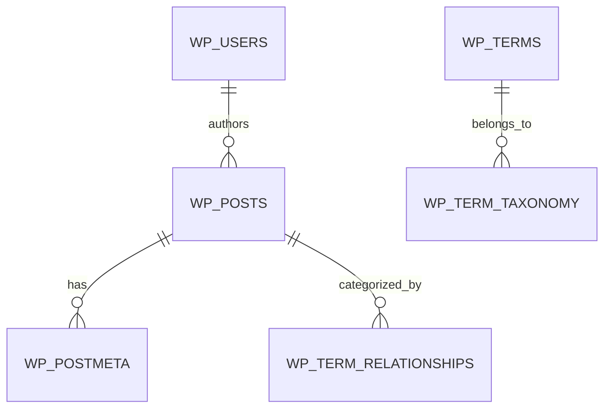

# 🗄️ Dokumentasi Skema Database: Grand Vanilla ID (WordPress)

Dokumentasi struktur tabel database **`grand_vanilla_wp`** pada sistem CMS **Grand Vanilla ID**.

---

## 📑 Struktur Tabel Utama

### 1. Tabel `wp_posts`
Menyimpan seluruh entitas konten:
- `post_type = 'page'`: Halaman statis (*Home*, *About Us*, *Products*, *Gallery*, *Articles*, *Contact Us*).
- `post_type = 'vanilla_product'`: Katalog produk komoditas vanili (*Planifolia*, *Tahitensis*, *Extraction Grade*).
- `post_type = 'vanilla_gallery'`: Dokumentasi visual kegiatan kebun dan penjemuran vanili.
- `post_type = 'post'`: Artikel edukasi dan berita ekspor vanili.

### 2. Tabel `wp_postmeta`
Menyimpan metadata dan spesifikasi teknis laboratorium produk:
- `_gv_grade`: Klasifikasi mutu (*Gourmet Grade A*, *Floral Grade*, *Extraction Grade B*).
- `_gv_vanillin`: Konsentrasi kadar vanilin (*1.8% – 2.4%*).
- `_gv_moisture`: Kadar air (*28% – 35%*).
- `_gv_length`: Panjang rata-rata polong (*16 – 20 cm*).
- `_gv_origin`: Asal daerah panen (*Jember, Bali, Papua*).

### 3. Tabel `wp_options`
Menyimpan konfigurasi situs, URL aktif (`siteurl`, `home`), pengaturan permalinks (`permalink_structure = '/%postname%/'`), tema aktif (`template = 'grand-vanilla-theme'`), dan navigasi menu.
